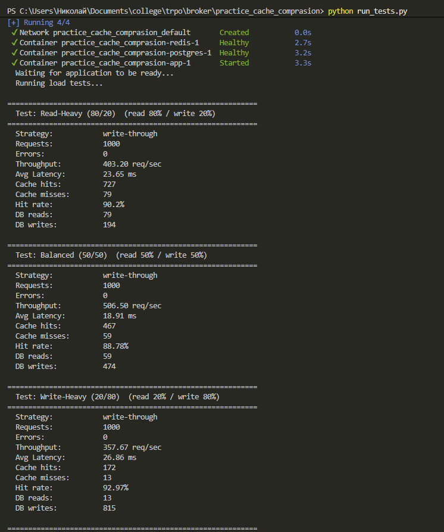
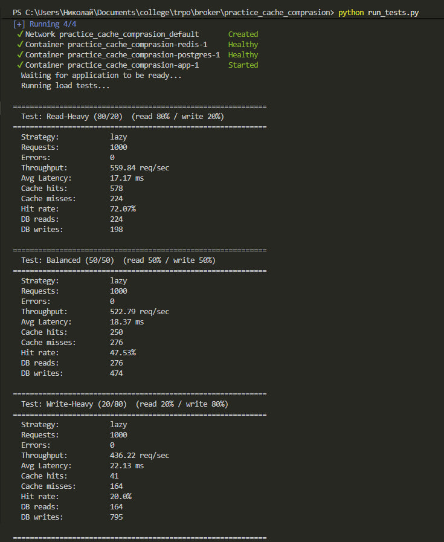

# Отчёт: Сравнение типов кеширования

## Состав системы

| Компонент       | Технология             |
|-----------------|------------------------|
| Application     | FastAPI (Python 3.11)  |
| Cache           | Redis 7                |
| БД              | PostgreSQL 15          |
| Load Generator  | Python (requests + ThreadPoolExecutor) |
| Оркестрация     | Docker Compose         |

## Описание стратегий

**Lazy Loading (Cache-Aside)** — чтение через кеш; при промахе — чтение из БД и запись в кеш; запись идёт напрямую в БД, кеш инвалидируется.

**Write-Through** — чтение через кеш; запись одновременно в кеш и в БД.

**Write-Back** — чтение через кеш; запись только в кеш; фоновый процесс сбрасывает накопленные записи в БД каждые 5 секунд.

## Описание тестов

Для каждой стратегии проведено 3 прогона с одинаковыми параметрами:

- **1000 запросов**, 10 параллельных потоков
- **100 продуктов** в базе (id 1–100)
- Операции: GET (чтение) и PUT (обновление)

| Прогон          | Read % | Write % |
|-----------------|--------|---------|
| Read-Heavy      | 80     | 20      |
| Balanced        | 50     | 50      |
| Write-Heavy     | 20     | 80      |

## Результаты

### Throughput (req/sec)

| Стратегия     | Read-Heavy | Balanced | Write-Heavy |
|---------------|------------|----------|-------------|
| Lazy Loading  | 490.67     | 389.22   | 340.64      |
| Write-Through | 515.10     | 474.79   | 417.65      |
| Write-Back    | **594.86** | **559.02** | **531.61** |

### Средняя задержка (ms)

| Стратегия     | Read-Heavy | Balanced | Write-Heavy |
|---------------|------------|----------|-------------|
| Lazy Loading  | 19.60      | 24.62    | 27.92       |
| Write-Through | 18.54      | 19.88    | 22.70       |
| Write-Back    | **15.90**  | **16.59** | **17.52**  |

### Hit Rate кеша (%)

| Стратегия     | Read-Heavy | Balanced | Write-Heavy |
|---------------|------------|----------|-------------|
| Lazy Loading  | 72.69      | 41.00    | 19.81       |
| Write-Through | 89.61      | 89.78    | 90.61       |
| Write-Back    | **89.79**  | **90.87** | **89.58**  |

### Обращения к БД

| Стратегия     | Тест         | DB Reads | DB Writes |
|---------------|--------------|----------|-----------|
| Lazy Loading  | Read-Heavy   | 222      | 187       |
| Lazy Loading  | Balanced     | 282      | 522       |
| Lazy Loading  | Write-Heavy  | 166      | 793       |
| Write-Through | Read-Heavy   | 82       | 211       |
| Write-Through | Balanced     | 51       | 501       |
| Write-Through | Write-Heavy  | 20       | 787       |
| Write-Back    | Read-Heavy   | 81       | 86        |
| Write-Back    | Balanced     | 46       | 100       |
| Write-Back    | Write-Heavy  | 20       | **100**   |

### Write-Back: накопление записей

При стратегии Write-Back запись идёт только в Redis. Фоновый процесс каждые 5 секунд собирает «грязные» ключи и пакетно записывает в БД. Благодаря этому количество DB Writes значительно ниже — Write-Back объединяет множественные записи одного и того же ключа в одну операцию. Например, при Write-Heavy нагрузке: Lazy Loading сделал 793 записи в БД, Write-Through — 787, а Write-Back — всего 100.

## Выводы

**Для чтения (Read-Heavy):** лучший вариант — **Write-Back** (594.86 req/s, 15.90 ms). Write-Through близок по hit rate (~90%), но медленнее из-за двойной записи. Lazy Loading показывает худший hit rate (72.69%), так как при записи кеш инвалидируется.

**Для записи (Write-Heavy):** лучший вариант — **Write-Back** (531.61 req/s, 17.52 ms). Запись идёт только в Redis, что максимально быстро. Количество обращений к БД минимально (100 vs 787–793). Компромисс — риск потери данных при сбое до flush.

**Для смешанной нагрузки (Balanced):** лучший вариант — **Write-Back** (559.02 req/s, 16.59 ms). Write-Through — стабильный средний вариант с гарантией консистентности. Lazy Loading проигрывает из-за низкого hit rate при частых записях.

| Критерий            | Лучшая стратегия | Примечание |
|---------------------|------------------|------------|
| Максимальная скорость | Write-Back     | Но есть риск потери данных |
| Консистентность     | Write-Through    | Данные всегда синхронизированы |
| Простота реализации | Lazy Loading     | Минимум логики |
| Минимум нагрузки на БД | Write-Back   | Пакетная запись объединяет операции |

## Скрины

### Lazy Loading Тесты

### Write-Through Тесты

### Write-Back Тесты

